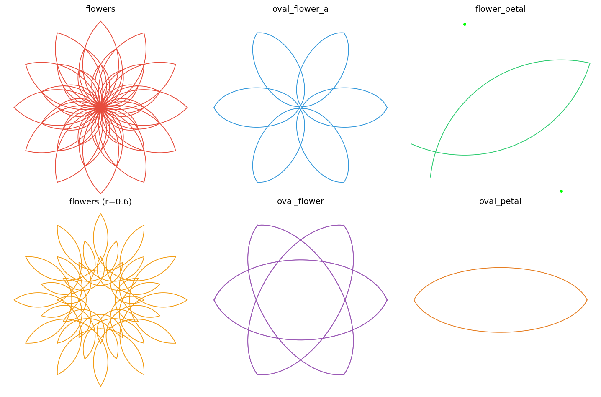
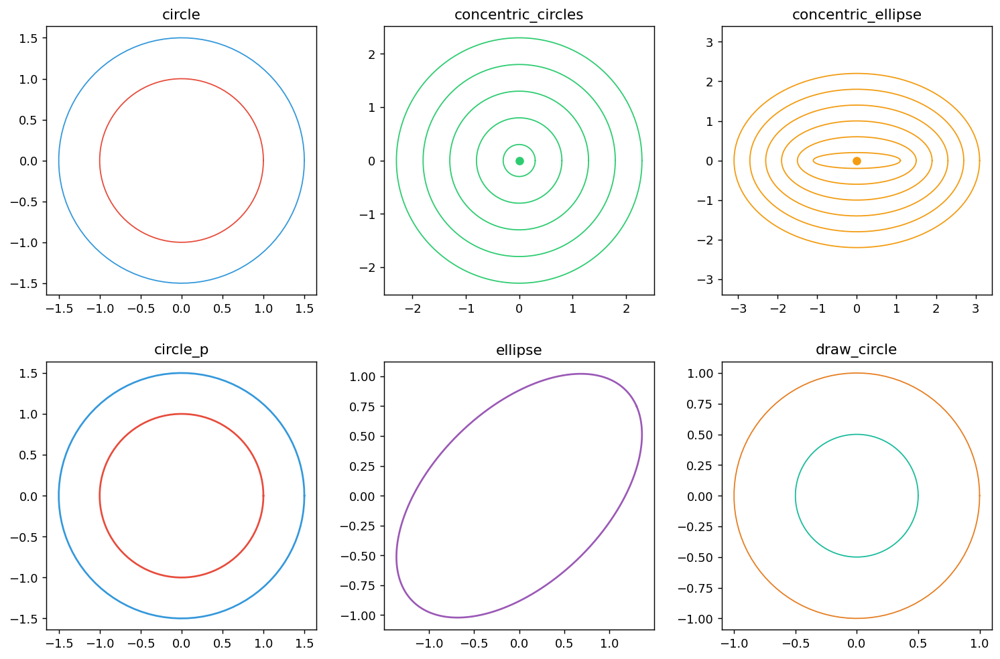
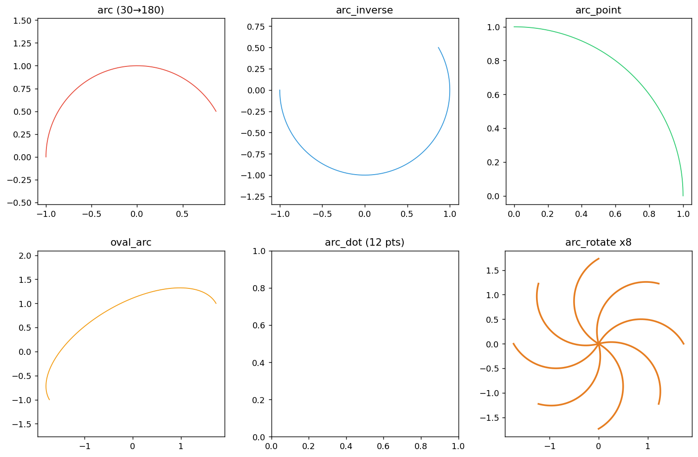
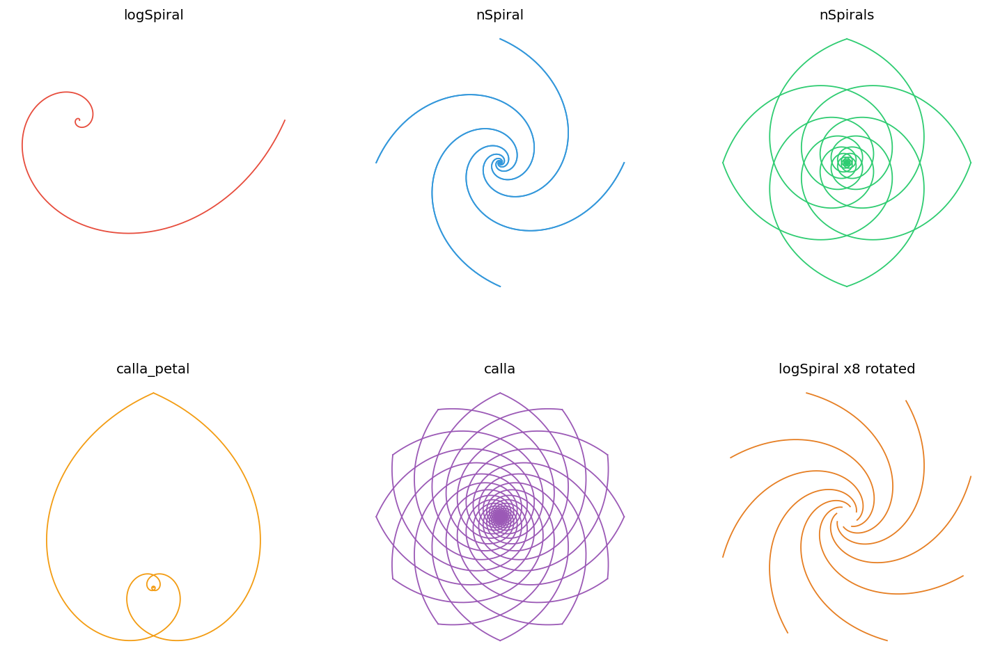
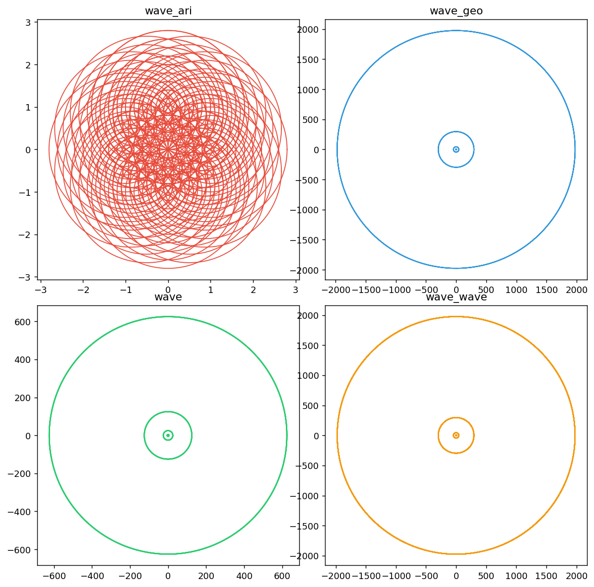
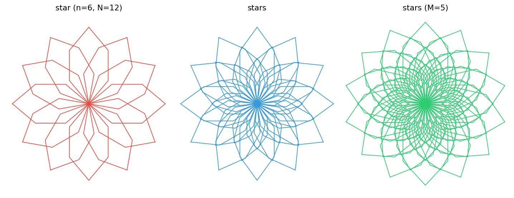
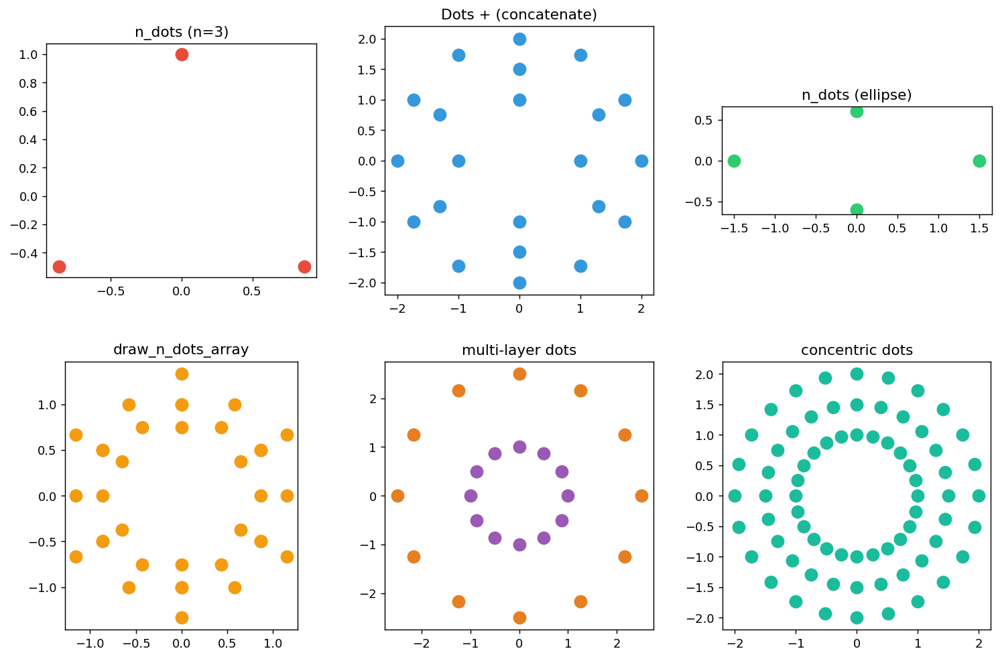
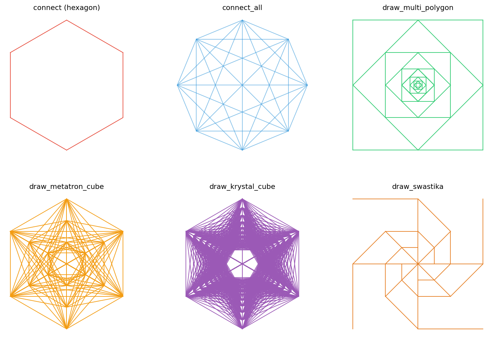

# CPR 可视化工具包

**cprdspy** 是一个基于 Matplotlib 和 Plotly 的 Python 几何图形可视化库，提供圆形、弧线、螺旋线、花朵、波形、星形、点阵和线条等丰富的几何图形绘制功能。

## 安装

```bash
pip install cprdspy
```

或从源码安装：

```bash
git clone https://github.com/lbylzk8/cprdspy.git
cd cprdspy
pip install -e .
```

## 快速开始

### 导入方式

```python
# 方式 1：从顶层导入（推荐，所有函数带 _mpl 后缀）
from cprdspy import flowers_mpl, arc_rotate_mpl, logSpiral_mpl

# 方式 2：从 CPR_matplotlib 子包导入（无后缀）
from cprdspy.CPR_matplotlib import flowers, arc_rotate, logSpiral
```

---

## 模块概览

CPR_matplotlib 包含 **8 个绘图模块**，覆盖 50+ 个绘图函数：

| 模块 | 功能 | 核心函数 |
|------|------|----------|
| **Flowers** | 花瓣与花朵 | `flowers`, `flower_petal`, `oval_flower`, `oval_petal` |
| **Circles** | 圆与椭圆 | `circle`, `concentric_circles`, `ellipse`, `draw_circle` |
| **Arcs** | 圆弧与椭圆弧 | `arc`, `arc_point`, `oval_arc`, `arc_rotate` |
| **Spirals** | 对数螺线 | `logSpiral`, `nSpiral`, `calla`, `calla_petal` |
| **Waves** | 波形图案 | `wave`, `wave_ari`, `wave_geo`, `wave_wave` |
| **Stars** | 星形图案 | `star`, `stars` |
| **Dots** | 点阵系统 | `n_dots`, `Dots`, `n_dots_array`, `draw_dots` |
| **Lines** | 连线系统 | `connect`, `connect_all`, `multi_polygon`, `metatron_cube` |

---

## 一、花朵模块 (Flowers)

绘制各种风格的花瓣和花朵图案。



### 基础花朵

```python
from cprdspy.CPR_matplotlib import *

# 经典 4 瓣花
flowers(R=1, r=1, n=4, color="#e74c3c")

# 6 瓣花（r < R 产生内凹效果）
flowers(R=1, r=0.6, n=6, color="#f39c12")

# 多层嵌套花（ratio 控制逐层缩放，M 控制层数）
flowers(R=1, r=1, n=4, ratio=1.3, M=3, N=12, color="blue")
```

### 椭圆花瓣

```python
# 椭圆花瓣花
oval_flower(a=1.5, b=0.6, d=0.3, n=6, color="#9b59b6")

# 旋转模式版本
oval_flower_a(a=1, b=0.6, d=0.3, n=6, color="#3498db")

# 单瓣椭圆花瓣
oval_petal(a=1.5, b=0.7, d=0.3, rotation=30, color="#e67e22")
```

### 圆形花瓣

```python
# 单瓣圆形花瓣
flower_petal(R=1, r=0.8, n=5, rotation=30, color="#2ecc71")
```

**参数说明：**
- `R` — 花瓣外接圆半径
- `r` — 花瓣弧半径（r > R·sin(π/n) 才能正常绘制）
- `n` — 花瓣数量
- `ratio` — 多层缩放比例
- `M` — 层数
- `N` — 每层花瓣数

---

## 二、圆形模块 (Circles)

绘制圆、椭圆、同心圆等基础图形。



```python
from cprdspy.CPR_matplotlib import *

# 基础圆
circle(radius=1, color="#e74c3c")

# 同心圆（等差/等比模式）
concentric_circles(n=5, radius=0.8, param=0.5, mode="arithmetic", color="#2ecc71")

# 同心椭圆
concentric_ellipse(n=4, a=1.5, b=0.6, param=0.4, color="#f39c12")

# 椭圆
ellipse(a=1.5, b=0.8, rotation=30, color="#9b59b6")

# 通过圆心和点画圆
circle_p(center=(0, 0), point=(1, 0), color="red")

# 实心圆
draw_circle(radius=1, color="#e67e22")
```

---

## 三、弧线模块 (Arcs)

绘制圆弧、椭圆弧以及可旋转的弧。



### 角度弧

```python
# 角度制（默认）
arc(r=1, angle1=30, angle2=180, color="#e74c3c")

# 弧度制
arc(r=1, angle1=np.pi/6, angle2=np.pi, use_degree=False, color="blue")

# 反向弧
arc_inverse(r=1, angle1=30, angle2=180, color="#3498db")
```

### 点定位弧

```python
# 通过圆心和两点画弧
arc_point(point1=(1, 0), point2=(0, 1), color="#2ecc71")
```

### 椭圆弧

```python
oval_arc(a=2, b=1, angle1=0, angle2=180, angle=30, color="#f39c12")
```

### 点弧（不连线，只画点）

```python
# 获取弧上的 12 个等分点
arc_dot(r=1, angle1=0, angle2=360, points=12, marker="o", color="#9b59b6")
```

### 可旋转弧

`arc_rotate` 将弧的 `angle2` 端点固定在 `center`，然后绕原点旋转指定角度。非常适合画旋转对称的弧花！

```python
# 8 条弧围绕原点均匀旋转
for i in range(8):
    arc_rotate(center=(0, 0), angle1=30, angle2=150,
               rotation=i * 45, color="#e67e22", linewidth=2)

# center 非原点时，弧的一端固定在 center 位置
for i in range(12):
    arc_rotate(center=(1, 1), angle1=45, angle2=135,
               rotation=i * 30, direction="ccw", color="red", linewidth=2)
```

**参数说明：**
- `angle1` / `angle2` — 起始/终止角度（支持角度制和弧度制）
- `center` — 弧的 `angle2` 端固定位置
- `rotation` — 绕原点的旋转角度
- `direction` — `"ccw"` 逆时针 / `"cw"` 顺时针

---

## 四、螺旋线模块 (Spirals)

绘制对数螺线、n 边形螺线及马蹄莲图案。



### 对数螺线

```python
# 基本对数螺线
logSpiral(n=4, a=1, b=1, cyc=1, color="#e74c3c")

# n 边形螺线
nSpiral(n=4, a=1, N=4, cyc=1, color="#3498db")

# 多头螺线
nSpirals(n=5, N=4, cyc=1.5, color="#2ecc71")
```

### 马蹄莲

```python
# 单片马蹄莲花瓣
calla_petal(n=4, a=1, cyc=1.25, color="#f39c12")

# 完整马蹄莲
calla(n=4, a=1, cyc=1.25, N=12, colors=["#9b59b6"] * 12)
```

### 旋转叠加

```python
# 多个旋转的螺线叠加
for i in range(8):
    logSpiral(n=3, a=1, b=1, cyc=0.3, theta=i * 45, color="#e67e22")
```

**参数说明：**
- `n` — 对称数（花瓣数）
- `cyc` — 周期数
- `theta` — 相位偏移
- `N` — 螺线头数（nSpiral/nSpirals/calla）

---

## 五、波形模块 (Waves)

绘制美丽的波形图案，基于圆上点的位移生成。



```python
from cprdspy.CPR_matplotlib import *

# 等差波形
wave_ari(A=0.2, F=4, P=12, color="#e74c3c")

# 等比波形
wave_geo(A=0.15, F=4, P=12, color="#3498db")

# 通用波形（mode 参数控制等差/等比）
wave(A=0.2, F=4, P=12, mode="geometric", color="#2ecc71")

# 波形叠加
wave_wave(A=0.15, F=4, P=12, color="#f39c12")
```

**参数说明：**
- `A` — 振幅系数
- `F` — 频率（波形层数）
- `P` — 每层点数
- `R` — 基础圆半径
- `show_center` — 是否显示中心圆

---

## 六、星形模块 (Stars)

绘制多层旋转的星形图案。



```python
from cprdspy.CPR_matplotlib import *

# 单层星形
star(R=1, r=1, n=6, N=12, color="#e74c3c")

# 多层星形（ratio 控制缩放，M 控制层数）
stars(R=1, r=1, n=5, ratio=1.3, M=3, N=12, color="#3498db")

# 更多层数
stars(R=1, r=1, n=7, ratio=1.2, M=5, N=14, color="#2ecc71")
```

---

## 七、点阵模块 (Dots)

灵活的点阵系统，支持 `+` 运算符拼接。



```python
from cprdspy.CPR_matplotlib import *

# 圆形点阵
draw_dots(n_dots(n=12, R=1), color="#e74c3c")

# 椭圆点阵
draw_dots(n_dots(n=8, R=1, shape="ellipse", a=1.5, b=0.6), color="#2ecc71")

# Dots 拼接（+ 运算符）
dots = n_dots(4, 1) + n_dots(6, 1.5) + n_dots(12, 2)
draw_dots(dots, color="#3498db")

# 圆形点阵数组
draw_n_dots_array(n=6, m=3, R=1, color="#f39c12")

# 多层同心圆点阵
draw_dots(n_dots(24, 1) + n_dots(24, 1.5) + n_dots(24, 2), color="#1abc9c")
```

**核心概念：**
- `Dots` — 点集容器，支持 `+` 拼接
- `n_dots(n, R)` — 生成 n 个等分点
- `n_dots_array(n, m, R)` — 生成多层点阵
- `shape` — 支持 `"circle"`, `"ellipse"`, `"superellipse"`

---

## 八、线条模块 (Lines)

基于点阵的连线系统，可绘制多边形、全连接图、梅塔特隆立方体等。



```python
from cprdspy.CPR_matplotlib import *

# 正多边形
draw_lines(connect(n_dots(6, 1), closed=True), color="#e74c3c")

# 全连接图（connect_all）
draw_lines(connect_all(n_dots(8, 1)), color="#3498db", linewidth=1)

# 多层正多边形
draw_multi_polygon(n=4, m=6, R=1, color="#2ecc71")

# 梅塔特隆立方体
draw_metatron_cube(n=6, m=3, color="#f39c12")

# 水晶立方体
draw_krystal_cube(n=6, m=4, color="#9b59b6")

# 卍字螺旋
draw_swastika(n=6, R=1, color="#e67e22")
```

**核心概念：**
- `Lines` — 线段容器，支持 `+` 拼接
- `connect(dots, closed=True)` — 按顺序连接点
- `connect_all(dots)` — 全连接（每对点之间）
- `metatron_cube` — 多层圆上点的全连接
- `krystal_cube` — 点阵全连接

---

## 全局配置

cprdspy 提供全局配置系统，支持主题切换和样式统一调整：

```python
from cprdspy import config, set_theme, get_available_themes

# 查看可用主题
print(get_available_themes())  # ['default', 'dark', 'light', ...]

# 设置主题
set_theme("dark")

# 自定义配置
config.line_width = 3
config.opacity = 0.8
config.show_grid = True

# 重置配置
reset_config()
```

---

## 项目结构

```
cprdspy/
├── cprdspy/
│   ├── __init__.py              # 顶层 API 导出
│   ├── config.py                # 全局配置系统
│   ├── CPR_matplotlib/          # Matplotlib 绘图模块
│   │   ├── Flowers/             #   花朵模块
│   │   ├── Circles/             #   圆形模块
│   │   ├── Arcs/                #   弧线模块
│   │   ├── Spirals/             #   螺旋线模块
│   │   ├── Waves/               #   波形模块
│   │   ├── Stars/               #   星形模块
│   │   ├── Dots/                #   点阵模块
│   │   └── Lines/               #   线条模块
│   └── CPR_plotly/              # Plotly 交互式绘图模块
└── examples/                    # 示例 Notebook
```

## 许可证

MIT License

## 贡献

欢迎提交 Issue 和 Pull Request！

1. Fork 仓库
2. 创建特性分支 (`git checkout -b feature/amazing-feature`)
3. 提交更改 (`git commit -m 'Add some amazing feature'`)
4. 推送到分支 (`git push origin feature/amazing-feature`)
5. 打开 Pull Request

## 联系方式

- 提交 Issue：[GitHub Issues](https://github.com/lbylzk8/cprdspy/issues)
- 邮箱：lbylzk8@outlook.com
