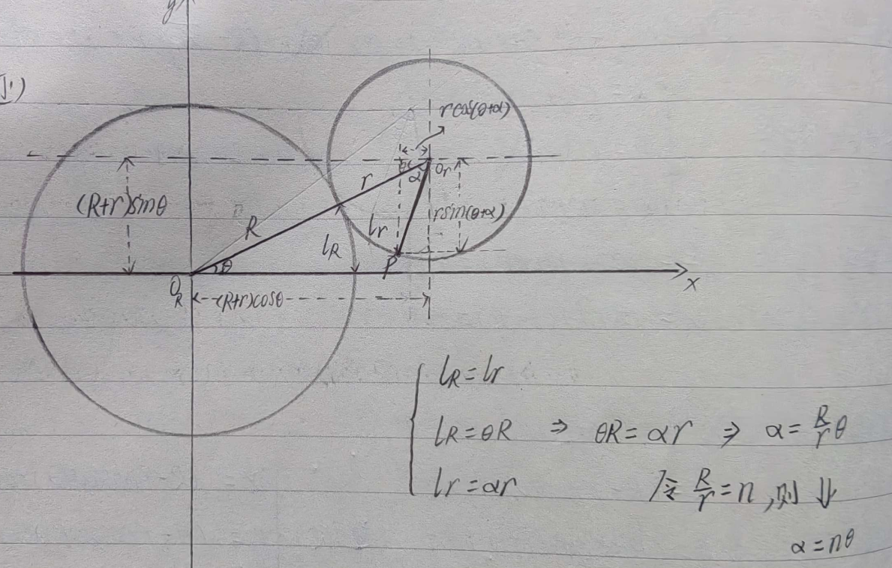
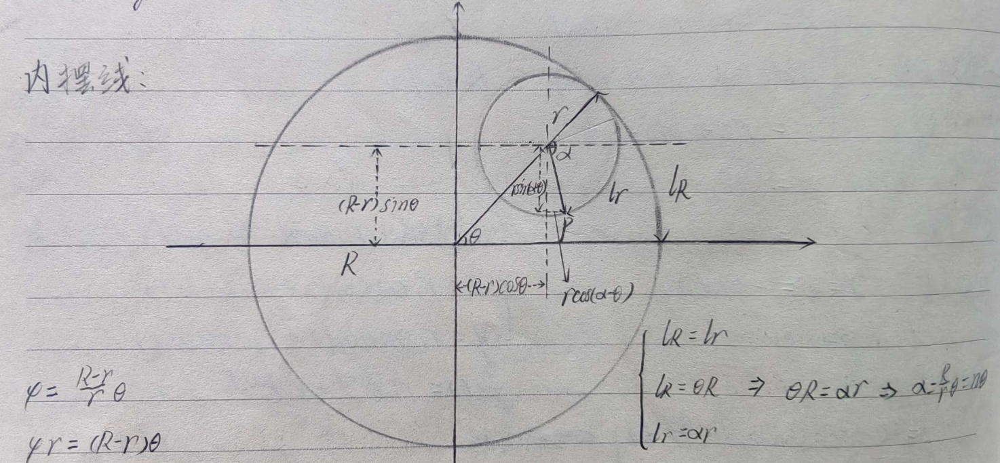

# 环面及环面螺旋线
## 环面方程
直角坐标：$\boldsymbol{(x^2+y^2+z^2+R^2-r^2)^2=4R^2(x^2+y^2)}$ 或 $\boldsymbol{(R-\sqrt{x^2+y^2})^2+z^2=r^2}$
参数方程：
$$
\begin{cases}
x=(R+r\cos v)\cos u\\
y=(R+r\cos v)\sin u\\
z=r\sin v
\end{cases}\quad u,v\in[0,2\pi]
$$
环面表面积：$\boldsymbol{S=(2\pi r)(2\pi R)=4\pi^2Rr}$
环面体积：$\boldsymbol{V=(\pi r^2)(2\pi R)=2\pi^2Rr^2}$

**GeoGebra 验证（3D 绘图区）：**
```geogebra
R = 2
r = 1
环面 = Surface((R + r cos(v)) cos(u), (R + r cos(v)) sin(u), r sin(v), u, 0, 2π, v, 0, 2π)
```

**Python 验证（matplotlib）：**
```python
import numpy as np
import matplotlib.pyplot as plt

R, r = 2, 1
u = np.linspace(0, 2 * np.pi, 80)
v = np.linspace(0, 2 * np.pi, 40)
u, v = np.meshgrid(u, v)

x = (R + r * np.cos(v)) * np.cos(u)
y = (R + r * np.cos(v)) * np.sin(u)
z = r * np.sin(v)

fig = plt.figure(figsize=(10, 8))
ax = fig.add_subplot(111, projection='3d')
ax.plot_surface(x, y, z, cmap='viridis', alpha=0.85, edgecolor='none')
ax.set_xlabel('x'); ax.set_ylabel('y'); ax.set_zlabel('z')
ax.set_title(f'Torus: R={R}, r={r}')
ax.set_box_aspect([1, 1, 1])
plt.show()
```

## 环面螺旋线（单螺设定）
参数方程：
右旋
$$
\begin{cases}
x=(R+r\cos\omega t)\cos t\\
y=(R+r\cos\omega t)\sin t\\
z=r\sin\omega t
\end{cases}
$$
左旋
$$
\begin{cases}
x=(R-r\cos\omega t)\cos t\\
y=(R-r\cos\omega t)\sin t\\
z=r\sin\omega t
\end{cases}\quad t\in[0,2\pi]
$$

**GeoGebra 验证（3D 绘图区）：**
```geogebra
R = 2
r = 1
ω = 12
右旋 = Curve((R + r cos(ω t)) cos(t), (R + r cos(ω t)) sin(t),  r sin(ω t), t, 0, 2π)
左旋 = Curve((R - r cos(ω t)) cos(t), (R - r cos(ω t)) sin(t), r sin(ω t), t, 0, 2π)
```
可调整 `R`、`r`、`ω` 滑块观察不同参数下的左右旋螺旋线。

**Python 验证：**
```python
import numpy as np
import matplotlib.pyplot as plt

R, r, ω = 2, 1, 12
t = np.linspace(0, 2 * np.pi, 2000)

# 右旋
xR = (R + r * np.cos(ω * t)) * np.cos(t)
yR = (R + r * np.cos(ω * t)) * np.sin(t)
zR = r * np.sin(ω * t)

# 左旋 (R - r cos ωt 版本：从小圆内侧起点出发)
xL = (R - r * np.cos(ω * t)) * np.cos(t)
yL = (R - r * np.cos(ω * t)) * np.sin(t)
zL = r * np.sin(ω * t)

fig = plt.figure(figsize=(14, 6))
ax1 = fig.add_subplot(121, projection='3d')
ax1.plot(xR, yR, zR, lw=0.6, color='red')
ax1.set_title(f'右旋 (R={R}, r={r}, ω={ω})')
ax1.set_box_aspect([1, 1, 1])

ax2 = fig.add_subplot(122, projection='3d')
ax2.plot(xL, yL, zL, lw=0.6, color='blue')
ax2.set_title(f'左旋 (R={R}, r={r}, ω={ω})')
ax2.set_box_aspect([1, 1, 1])
plt.show()
```

## 环形螺旋线(Circular Helix) 一般方程
$$
\begin{cases}
x=(R+r\cos\omega t)\cos \phi t\\
y=(R+r\cos\omega t)\sin \phi t\\
z=r\sin\omega t+at
\end{cases}\quad t\in \mathbb{R}
$$

**GeoGebra 验证（3D 绘图区，含轴向漂移）：**
```geogebra
R = 2
r = 1
ω = 12
φ = 13
a = 0.05
广义螺旋线 = Curve((R + r cos(ω t)) cos(φ t), (R + r cos(ω t)) sin(φ t), r sin(ω t) + a t, t, 0, 4π)
```

**Python 验证（对比不同参数）：**
```python
import numpy as np
import matplotlib.pyplot as plt

R, r, ω, φ = 2, 1, 12, 13
t = np.linspace(0, 4 * np.pi, 3000)

fig = plt.figure(figsize=(16, 5))
configs = [(12, 13, 0, 'ω=12, φ=13, a=0 (纯环面)'),
            (12, 13, 0.05, 'ω=12, φ=13, a=0.05 (轴向漂移)'),
            (5, 7, 0, 'ω=5, φ=7, a=0 (不同缠绕)')]
for i, (w, p, a, title) in enumerate(configs):
    ax = fig.add_subplot(1, 3, i+1, projection='3d')
    x = (R + r * np.cos(w * t)) * np.cos(p * t)
    y = (R + r * np.cos(w * t)) * np.sin(p * t)
    z = r * np.sin(w * t) + a * t
    ax.plot(x, y, z, lw=0.5)
    ax.set_title(title); ax.set_box_aspect([1, 1, 1])
plt.show()
```

## 罗丹线圈标准数学形式
$$
\begin{cases}
x(t)=(2+\cos(12t))\cos(13t)\\
y(t)=(2+\cos(12t))\sin(13t)\\
z(t)=\sin(12t)
\end{cases}\quad t\in[0,2\pi]
$$

**GeoGebra 验证：**
```geogebra
罗丹线圈 = Curve((2 + cos(12 t)) cos(13 t), (2 + cos(12 t)) sin(13 t), sin(12 t), t, 0, 2π)
```

**Python 验证：**
```python
import numpy as np
import matplotlib.pyplot as plt

t = np.linspace(0, 2 * np.pi, 2000)
x = (2 + np.cos(12 * t)) * np.cos(13 * t)
y = (2 + np.cos(12 * t)) * np.sin(13 * t)
z = np.sin(12 * t)

fig = plt.figure(figsize=(9, 8))
ax = fig.add_subplot(111, projection='3d')
ax.plot(x, y, z, lw=0.5, color='darkorange')
ax.set_title('罗丹线圈: (2+cos12t)cos13t, (2+cos12t)sin13t, sin12t')
ax.set_box_aspect([1, 1, 1])
plt.show()
```

## 摆线
### 直摆线
$$
\begin{cases}
x=r(t-\sin t)\\
y=r(1-\cos t)
\end{cases}
$$

**GeoGebra 验证：**
```geogebra
r = 1
n = 3
直摆线 = Curve(r (t - sin(t)), r (1 - cos(t)), t, 0, 2n π)
```

**Python 验证：**
```python
import numpy as np
import matplotlib.pyplot as plt

r, n = 1, 3
t = np.linspace(0, 2 * n * np.pi, 1000)
x = r * (t - np.sin(t))
y = r * (1 - np.cos(t))

plt.figure(figsize=(12, 3))
plt.plot(x, y, 'b', lw=1)
plt.title(f'Cycloid: r={r}, {n} arches'); plt.axis('equal')
plt.show()
```

**中心摆线(Centered Trochoid)一般方程**
$$
\begin{cases}
x=r_1\cos(\omega_1 t)+r_2\cos(\omega_2 t)\\
y=r_1\sin(\omega_1 t)+r_2\sin(\omega_2 t)
\end{cases}\quad f(t)=r_1e^{j\omega_1 t}+r_2e^{j\omega_2 t},\ r_1,r_2,\omega_1,\omega_2\neq0,\omega_1\neq\omega_2
$$

**GeoGebra 验证：**
```geogebra
r1 = 2;  ω1 = 3
r2 = 1;  ω2 = 5
中心摆线 = Curve(r1 cos(ω1 t) + r2 cos(ω2 t), r1 sin(ω1 t) + r2 sin(ω2 t), t, 0, 2π)
```

**Python 验证：**
```python
import numpy as np
import matplotlib.pyplot as plt

r1, ω1, r2, ω2 = 2, 3, 1, 5
t = np.linspace(0, 2 * np.pi, 2000)
x = r1 * np.cos(ω1 * t) + r2 * np.cos(ω2 * t)
y = r1 * np.sin(ω1 * t) + r2 * np.sin(ω2 * t)

plt.figure(figsize=(7, 7))
plt.plot(x, y, 'purple', lw=0.8)
plt.title(f'Centered Trochoid: r₁={r1}, ω₁={ω1}, r₂={r2}, ω₂={ω2}')
plt.axis('equal'); plt.show()
```
### 圆内摆线
$$
\begin{cases}
x=(R-r)\cos t+h\cos\left(\frac{R-r}{r}t\right)\\
y=(R-r)\sin t-h\sin\left(\frac{R-r}{r}t\right)
\end{cases}
$$
极坐标方程：$\boldsymbol{\rho^2=x^2+y^2=(R-r)^2+h^2+2(R-r)h\cos\left(\frac{R}{r}t\right)}$

**GeoGebra 验证：**
```geogebra
R = 5;  r = 2;  h = 1.5
圆内摆线 = Curve((R - r) cos(t) + h cos((R - r) / r t), (R - r) sin(t) - h sin((R - r) / r t), t, 0, 2r π)
```

**Python 验证（h=r 即标准内摆线 vs h<r 短摆线 vs h>r 长摆线）：**
```python
import numpy as np
import matplotlib.pyplot as plt

R, r = 5, 2
t = np.linspace(0, 2 * r * np.pi, 2000)

fig, axes = plt.subplots(1, 3, figsize=(15, 5))
for ax, h, label in zip(axes, [1.0, 2.0, 3.0],
                         ['h<r (Curtate hypocycloid)', 'h=r (Hypocycloid)', 'h>r (Prolate hypocycloid)']):
    x = (R - r) * np.cos(t) + h * np.cos((R - r) / r * t)
    y = (R - r) * np.sin(t) - h * np.sin((R - r) / r * t)
    ax.plot(x, y, lw=0.6)
    ax.set_title(f'{label}\nR={R}, r={r}, h={h}')
    ax.axis('equal')
plt.tight_layout(); plt.show()
```
### 圆外摆线
$$
\begin{cases}
x=(R+r)\cos t-h\cos\left(\frac{R+r}{r}t\right)\\
y=(R+r)\sin t-h\sin\left(\frac{R+r}{r}t\right)
\end{cases}
$$
极坐标方程：$\boldsymbol{\rho^2=x^2+y^2=(R+r)^2+h^2-2(R+r)h\cos\frac{R}{r}t}$

**GeoGebra 验证：**
```geogebra
R = 4;  r = 1;  h = 1
圆外摆线 = Curve((R + r) cos(t) - h cos((R + r) / r t), (R + r) sin(t) - h sin((R + r) / r t), t, 0, 2r π)
```

**Python 验证（h=r 标准外摆线 vs h<r vs h>r）：**
```python
import numpy as np
import matplotlib.pyplot as plt

R, r = 4, 1
t = np.linspace(0, 2 * r * np.pi, 2000)

fig, axes = plt.subplots(1, 3, figsize=(15, 5))
for ax, h, label in zip(axes, [0.5, 1.0, 2.0],
                         ['h<r (Curtate epicycloid)', 'h=r (Epicycloid)', 'h>r (Prolate epicycloid)']):
    x = (R + r) * np.cos(t) - h * np.cos((R + r) / r * t)
    y = (R + r) * np.sin(t) - h * np.sin((R + r) / r * t)
    ax.plot(x, y, lw=0.6)
    ax.set_title(f'{label}\nR={R}, r={r}, h={h}')
    ax.axis('equal')
plt.tight_layout(); plt.show()
```

---

# 摆线公式推导
## 外摆线（动点$P$的轨迹）

几何关系：
$$
\begin{cases}
l_R=l_r\\
l_R=\theta R,\ l_r=\alpha r \Rightarrow \theta R=\alpha r \Rightarrow \alpha=\frac{R}{r}\theta\\
\text{令}\ \frac{R}{r}=n,\ \alpha=n\theta
\end{cases}
$$
参数方程：
$$
\begin{cases}
x=(R+r)\cos\theta-r\cos(\theta+\alpha)=(R+r)\cos\theta-r\cos\left(\frac{R+r}{r}\theta\right)=(R+r)\cos\theta-r\cos(n+1)\theta\\
y=(R+r)\sin\theta-r\sin(\theta+\alpha)=(R+r)\sin\theta-r\sin\left(\frac{R+r}{r}\theta\right)=(R+r)\sin\theta-r\sin(n+1)\theta
\end{cases}
$$

## 内摆线


$\varphi=\frac{R-r}{r}\theta,\ \varphi r=(R-r)\theta$
几何：
$$
\begin{cases}
l_R=l_r\\
l_R=\theta R,\ l_r=\alpha r \Rightarrow \theta R=\alpha r\Rightarrow \alpha=\frac{R}{r}\theta
\end{cases}
$$
参数方程：
$$
\begin{cases}
x=(R-r)\cos\theta+r\cos(\alpha-\theta)=(R-r)\cos\theta+r\cos\left(\frac{R-r}{r}\theta\right)=(R-r)\cos\theta+r\cos(n-1)\theta\\
y=(R-r)\sin\theta-r\sin(\alpha-\theta)=(R-r)\sin\theta-r\sin\left(\frac{R-r}{r}\theta\right)=(R-r)\sin\theta-r\sin(n-1)\theta
\end{cases}
$$

---

## 短摆线：$P$点不取$r$上，而取半径$\boldsymbol{h<r}$的$O_r$同心圆上
### 外短摆线
$$
\begin{cases}
x=(R+r)\cos\theta-h\cos(\theta+\alpha)=(R+r)\cos\theta-h\cos\left(\frac{R+r}{r}\theta\right)=(R+r)\cos\theta-h\cos(n+1)\theta\\
y=(R+r)\sin\theta-h\sin(\theta+\alpha)=(R+r)\sin\theta-h\sin\left(\frac{R+r}{r}\theta\right)=(R+r)\sin\theta-h\sin(n+1)\theta
\end{cases}
$$
### 内短摆线
$$
\begin{cases}
x=(R-r)\cos\theta+h\cos(\alpha-\theta)=(R-r)\cos\theta+h\cos\left(\frac{R-r}{r}\theta\right)=(R-r)\cos\theta+h\cos(n-1)\theta\\
y=(R-r)\sin\theta-h\sin(\alpha-\theta)=(R-r)\sin\theta-h\sin\left(\frac{R-r}{r}\theta\right)=(R-r)\sin\theta-h\sin(n-1)\theta
\end{cases}
$$
**长摆线：$P$点不取$r$上，而取半径$\boldsymbol{h>r}$的$O_r$同心圆上，方程同上**

## 变换
将大小圆半径作如下变换：
$R+r\Rightarrow R'$，即：$R'-R\Rightarrow r$，则：
外摆线：
$$
\begin{cases}
x=(R+r)\cos\theta-r\cos\left(\frac{R+r}{r}\theta\right)=R'\cos\theta-r\cos\left(\frac{R'}{r}\theta\right)=R'\cos\theta-r\cos(n'\theta)\\
y=(R+r)\sin\theta-r\sin\left(\frac{R+r}{r}\theta\right)=R'\sin\theta-r\sin\left(\frac{R'}{r}\theta\right)=R'\sin\theta-r\sin(n'\theta)
\end{cases}\quad n'=\frac{R'}{r}
$$
若 $R-r\Rightarrow R'$（此时 $R-R'=r$），则：
内摆线：
$$
\begin{cases}
x=(R-r)\cos\theta+r\cos\left(\frac{R-r}{r}\theta\right)=R'\cos\theta+r\cos\left(\frac{R'}{r}\theta\right)=R'\cos\theta+r\cos(n'\theta)\\
y=(R-r)\sin\theta-r\sin\left(\frac{R-r}{r}\theta\right)=R'\sin\theta-r\sin\left(\frac{R'}{r}\theta\right)=R'\sin\theta-r\sin(n'\theta)
\end{cases}\quad n'=\frac{R'}{r}
$$

这样，内外摆线方程就统一了，为：
$$
\begin{cases}
x=R\cos\theta+r\cos\alpha\\
y=R\sin\theta+r\sin\alpha
\end{cases}\quad \alpha=n\theta=\frac{R}{r}\theta
$$
注意到这里都是加$(+)$号，而之前的公式有负$(-)$号。这是因为$\alpha$的相位不同导致的，正$(+)$、负$(-)$号的选取只与$\alpha$初始相位在哪个区间有关，一象限$x,y$两个方程符号为$(+,+)$，二象限$(-,+)$，三象限$(-,-)$，四象限$(+,-)$。


## 圆中转圈与傅里叶级数
把上节摆线统一方程变换一下：
$$
\begin{cases}
x-R\cos\theta=r\cos\alpha\\
y-R\sin\theta=r\sin\alpha
\end{cases}
\iff
(x-R\cos\theta)^2+(y-R\sin\theta)^2=r^2
$$
这不是一个圆的方程吗？只不过圆心为动点，且在半径为$R$的圆周上运动（牵连动力）。

由此推广成傅里叶级数：
$$
\begin{cases}
x=r_1\cos\theta_1+r_2\cos\theta_2+\dots+r_n\cos\theta_n=\displaystyle\sum_{i=1}^n r_i\cos\theta_i\\
y=r_1\sin\theta_1+r_2\sin\theta_2+\dots+r_n\sin\theta_n=\displaystyle\sum_{i=1}^n r_i\sin\theta_i
\end{cases}
$$
即：
$$
\begin{cases}
\big(\dots\big((x-r_1\cos\theta_1)-r_2\cos\theta_2\big)-\dots\big)-r_{n-1}\cos\theta_{n-1}=r_n\cos\theta_n\\
\big(\dots\big((y-r_1\sin\theta_1)-r_2\sin\theta_2\big)-\dots\big)-r_{n-1}\sin\theta_{n-1}=r_n\sin\theta_n
\end{cases}
$$
亦即：
$$
\Big(\big(\dots((x-r_1\cos\theta_1)-r_2\cos\theta_2)-\dots\big)-r_{n-1}\cos\theta_{n-1}\Big)^2
+\Big(\big(\dots((y-r_1\sin\theta_1)-r_2\sin\theta_2)-\dots\big)-r_{n-1}\sin\theta_{n-1}\Big)^2=r_n^2
$$
这便形成了类似星球运转的模式：卫星围绕行星转，行星围绕恒星，恒星围绕星系转……

傅里叶级数告诉我们它可以模拟任意函数，同样，只要$r_i$和$\theta_i$选取得当，我们的方程可以模拟以半径$\displaystyle\sum_{i=1}^n r_i$的圆内的任何图案。
即：
$$
\begin{cases}
x=\displaystyle\sum_{i=1}^n r_i\cos(a_i\theta+\varphi_i)\\
y=\displaystyle\sum_{i=1}^n r_i\sin(a_i\theta+\varphi_i)
\end{cases}
$$
是原点中心半径$\displaystyle\sum_{i=1}^n r_i$的圆内任意图形

**Python 验证（计算外摆线 / Epicycles — DFT 逼近任意闭合曲线）：**
```python
import numpy as np
import matplotlib.pyplot as plt
from matplotlib.animation import FuncAnimation

# --- 1. 定义目标曲线 (可替换为任意闭合曲线的采样点) ---
N = 200  # 采样点数
t = np.linspace(0, 2 * np.pi, N, endpoint=False)
# 示例：心形 + 三角形混合
target_x = 2 * np.sin(t) + np.sin(2 * t) + 0.5 * np.cos(3 * t)
target_y = 2 * np.cos(t) - np.cos(2 * t) + 0.5 * np.sin(3 * t)

# --- 2. DFT 提取外摆线系数 ---
coeffs_x = np.fft.fft(target_x) / N
coeffs_y = np.fft.fft(target_y) / N

# 按振幅降序排列（从最大圆开始画）
amps = np.abs(coeffs_x) + np.abs(coeffs_y)
order = np.argsort(-amps)

# --- 3. 静态绘制外摆线叠加 ---
fig, ax = plt.subplots(figsize=(8, 8))
ax.plot(target_x, target_y, 'k-', lw=2, label='目标曲线')

cum_x, cum_y = 0, 0
for k in order[:12]:  # 取前12个频率分量
    r = np.sqrt(np.abs(coeffs_x[k])**2 + np.abs(coeffs_y[k])**2)
    if r < 0.02:
        continue
    # 这个圆的圆心在 (cum_x, cum_y)，半径 r
    circ = plt.Circle((cum_x, cum_y), r, fill=False, ec='gray', lw=0.4)
    ax.add_patch(circ)
    cum_x += 2 * np.real(coeffs_x[k])
    cum_y += 2 * np.real(coeffs_y[k])

ax.plot(cum_x, cum_y, 'ro', ms=4, label='末端点')
ax.axis('equal'); ax.set_title(f'Epicycles: {len(order)} 个频率分量逼近曲线')
ax.legend(); plt.show()

# --- 4. 动画（可选） ---
# fig, ax = plt.subplots(figsize=(8, 8))
# def update(frame):
#     ax.clear(); ax.axis('equal')
#     ax.set_xlim(-5, 5); ax.set_ylim(-5, 5)
#     px, py = 0, 0
#     t_now = frame * 2 * np.pi / 100
#     for k in order[:12]:
#         r = np.sqrt(np.abs(coeffs_x[k])**2 + np.abs(coeffs_y[k])**2)
#         phi = np.angle(coeffs_x[k] + 1j * coeffs_y[k])
#         if r < 0.02: continue
#         circ = plt.Circle((px, py), r, fill=False, ec='gray', lw=0.4)
#         ax.add_patch(circ)
#         px += 2 * r * np.cos(k * t_now + phi)
#         py += 2 * r * np.sin(k * t_now + phi)
#     ax.plot(px, py, 'ro', ms=4)
# ani = FuncAnimation(fig, update, frames=100, interval=50)
# plt.show()
```

有了平面的圆中转圈我们自然会想三维空间的转动呢？它是球面内的转动，由于傅里叶级数只有$\sin\theta$和$\cos\theta$，没有其它；我们可以用它俩表示$x,y$但不能新创一个表示$z$，怎么办？最好的办法是从球的参数方程找灵感：
$$
\begin{cases}
x=R\cos\theta\cos\varphi\\
y=R\cos\theta\sin\varphi\\
z=R\sin\theta
\end{cases}
$$
多么触动！$x,y$是一对，它们的平方和根号下与$z$是一对，傅里叶级数只涉及正余弦的加减法，推广到三维则借助了它们的乘法！

---

由此，我们可以构建三维空间的傅里叶及摆线了，先从三维摆线开始
## 圆圈上的球面运动
摆线在大圆$R$上转动，有$\begin{cases}x=R\cos\theta\\y=R\sin\theta\end{cases}$，然后它们在小球上运动：
$$
\begin{cases}
x-R\cos\theta=r\cos(n\theta)\cos\varphi\\
y-R\sin\theta=r\sin(n\theta)\cos\varphi\\
z-0=r\sin\varphi
\end{cases}
$$

## 球面上的球面运动
$$
\begin{cases}
x-R\cos\theta_1\cos\varphi_1=r\cos\theta_2\cos\varphi_2\\
y-R\cos\theta_1\sin\varphi_1=r\cos\theta_2\sin\varphi_2\\
z-R\sin\theta_1=r\sin\theta_2
\end{cases}
\Rightarrow\text{推广}
\begin{cases}
x=\displaystyle\sum_{i=1}^n r_i\cos\theta_i\cos\varphi_i\\
y=\displaystyle\sum_{i=1}^n r_i\cos\theta_i\sin\varphi_i\\
z=\displaystyle\sum_{i=1}^n r_i\sin\theta_i
\end{cases}
$$

## 球面上的圈运动
$$
\begin{cases}
x-R\cos\theta_1\cos\varphi_1=r\cos\varphi_1\\
y-R\cos\theta_1\sin\varphi_1=r\sin\varphi_1\\
z-R\sin\theta_1=0
\end{cases}
$$

由此我们看到，多一种运动用加法，多一个维度用乘法！
少一种运动（换一个方向）用减法，少一个维度用除法！

**备查：球坐标参数方程 GeoGebra：**
```geogebra
R = 3
球面 = Surface(R cos(θ) cos(φ), R cos(θ) sin(φ), R sin(θ), θ, -π/2, π/2, φ, 0, 2π)
```

**备查：球坐标参数方程 Python：**
```python
import numpy as np
import matplotlib.pyplot as plt

R = 3
θ = np.linspace(-np.pi/2, np.pi/2, 40)
φ = np.linspace(0, 2*np.pi, 60)
θ, φ = np.meshgrid(θ, φ)
x = R * np.cos(θ) * np.cos(φ)
y = R * np.cos(θ) * np.sin(φ)
z = R * np.sin(θ)

fig = plt.figure(figsize=(8, 8))
ax = fig.add_subplot(111, projection='3d')
ax.plot_surface(x, y, z, cmap='Blues', alpha=0.6, edgecolor='none')
ax.set_box_aspect([1, 1, 1]); plt.show()
```

**圆圈上的球面运动的 Python 验证（三维摆线）：**
```python
import numpy as np
import matplotlib.pyplot as plt

R, r, n = 3, 1, 5  # 大圆半径, 小球半径, 缠绕数
t = np.linspace(0, 2*np.pi, 1000)
φ = np.linspace(0, 2*np.pi, 1000)  # 球面纬度方向

# 大圆上的动点 (圆心在圆周上运动)
cx, cy = R * np.cos(t), R * np.sin(t)

# 三维摆线：圆心在 (cx,cy,0)，在小球面上作纬圈运动
x = cx + r * np.cos(n * t)[:, None] * np.cos(φ)[None, :]
y = cy + r * np.sin(n * t)[:, None] * np.cos(φ)[None, :]
z = np.zeros_like(t)[:, None] + r * np.sin(φ)[None, :]

# 取 φ=0 截线（小球的赤道）
fig = plt.figure(figsize=(10, 8))
ax = fig.add_subplot(111, projection='3d')
ax.plot(cx, cy, 0, 'gray', lw=1, label='大圆 R')
# 画几根小球在球面上的轨迹
for phi in [0, np.pi/4, np.pi/2]:
    xx = cx + r * np.cos(n * t) * np.cos(phi)
    yy = cy + r * np.sin(n * t) * np.cos(phi)
    zz = r * np.sin(phi) * np.ones_like(t)
    ax.plot(xx, yy, zz, lw=0.6, label=f'φ={phi:.2f}')
ax.set_box_aspect([1, 1, 1]); ax.legend(); plt.show()
```

**球面上球面运动推广的 Python 验证（多级球面外摆线）：**
```python
import numpy as np
import matplotlib.pyplot as plt

# 三级球面转圈
radii = [2, 1, 0.5]       # r₁, r₂, r₃
alphas = [1, 7, 23]       # 纬向频率 (θ = α*t)
betas = [3, 11, 29]       # 经向频率 (φ = β*t)
phases = [0, 1, 2]        # 初始相位
t = np.linspace(0, 2*np.pi, 3000)

x = np.zeros_like(t)
y = np.zeros_like(t)
z = np.zeros_like(t)

fig = plt.figure(figsize=(10, 8))
ax = fig.add_subplot(111, projection='3d')

cum = np.zeros((3, len(t)))
for r, a, b, p in zip(radii, alphas, betas, phases):
    dx = r * np.cos(a * t + p) * np.cos(b * t + p)
    dy = r * np.cos(a * t + p) * np.sin(b * t + p)
    dz = r * np.sin(a * t + p)
    cum[0] += dx; cum[1] += dy; cum[2] += dz
    ax.plot(cum[0], cum[1], cum[2], lw=0.5, alpha=0.5,
            label=f'r={r}, α={a}, β={b}')

ax.plot(cum[0], cum[1], cum[2], 'k', lw=1.2, label='合成轨迹')
ax.set_box_aspect([1, 1, 1]); ax.legend(loc='upper right')
ax.set_title('球面上球面运动: 多级转圈的叠加')
plt.show()
```

**球面上圈运动的 Python 验证：**
```python
import numpy as np
import matplotlib.pyplot as plt

R, r = 3, 1
t = np.linspace(0, 2*np.pi, 2000)

# 球面上大圆旋转中心的轨迹
θ1, φ1 = np.pi/4, t  # 大圆在赤纬 π/4 处绕 z 轴旋转

# 运动限制在球面切平面上的小圈 (z 无变化)
θ2, φ2 = 0, t        # 小圈在赤道面上

x = R * np.cos(θ1) * np.cos(φ1) + r * np.cos(φ2)
y = R * np.cos(θ1) * np.sin(φ1) + r * np.sin(φ2)
z = R * np.sin(θ1) * np.ones_like(t)

fig = plt.figure(figsize=(9, 8))
ax = fig.add_subplot(111, projection='3d')
ax.plot(x, y, z, lw=0.6)
# 标注大圆参考
ax.plot(R*np.cos(t), R*np.sin(t), 0, 'gray', lw=0.5, alpha=0.5, label='参考大圆')
ax.set_box_aspect([1, 1, 1]); ax.legend(); plt.show()
```

---

# 三维傅里叶级数的一般形式

前面我们从环面和摆线出发，逐步推广到了球面上的多级转动。本节给出三维空间周期曲线傅里叶级数的完整数学形式。

## 一、Cartesian 实数形式

设空间周期曲线 $\gamma(t)=(x(t),y(t),z(t))$，周期 $T=2\pi/\omega$。三个坐标分量各自展开为一维傅里叶级数：

$$
\boxed{
\begin{aligned}
x(t) &= \frac{a_0^{(x)}}{2} + \sum_{n=1}^{\infty} \Big[ a_n^{(x)} \cos(n\omega t) + b_n^{(x)} \sin(n\omega t) \Big] \\[8pt]
y(t) &= \frac{a_0^{(y)}}{2} + \sum_{n=1}^{\infty} \Big[ a_n^{(y)} \cos(n\omega t) + b_n^{(y)} \sin(n\omega t) \Big] \\[8pt]
z(t) &= \frac{a_0^{(z)}}{2} + \sum_{n=1}^{\infty} \Big[ a_n^{(z)} \cos(n\omega t) + b_n^{(z)} \sin(n\omega t) \Big]
\end{aligned}
}
$$

其中系数由正交投影给出（以 $x$ 坐标为例）：

$$
a_n^{(x)} = \frac{2}{T}\int_0^T x(t)\cos(n\omega t)\,dt,\qquad
b_n^{(x)} = \frac{2}{T}\int_0^T x(t)\sin(n\omega t)\,dt
$$

写成向量形式，令 $\mathbf{A}_n=(a_n^{(x)},a_n^{(y)},a_n^{(z)})^\top,\ \mathbf{B}_n=(b_n^{(x)},b_n^{(y)},b_n^{(z)})^\top$：

$$
\boxed{\gamma(t) = \frac{\mathbf{A}_0}{2} + \sum_{n=1}^{\infty} \Big[ \mathbf{A}_n \cos(n\omega t) + \mathbf{B}_n \sin(n\omega t) \Big]}
$$

## 二、Cartesian 复数形式

利用 Euler 公式 $\cos\theta=\frac{e^{i\theta}+e^{-i\theta}}{2},\ \sin\theta=\frac{e^{i\theta}-e^{-i\theta}}{2i}$，将实数形式合并为双边复指数级数：

$$
\boxed{\gamma(t) = \sum_{n=-\infty}^{\infty} \mathbf{c}_n\, e^{i n \omega t}, \qquad \mathbf{c}_n = \begin{pmatrix} c_n^{(x)} \\ c_n^{(y)} \\ c_n^{(z)} \end{pmatrix} \in \mathbb{C}^3}
$$

系数由复内积给出：

$$
\mathbf{c}_n = \frac{1}{T}\int_0^T \gamma(t)\,e^{-i n \omega t}\,dt
$$

实数系数与复数系数的转换关系（对每个坐标 $k=x,y,z$）：

$$
c_0^{(k)} = \frac{a_0^{(k)}}{2},\qquad
c_n^{(k)} = \frac{a_n^{(k)} - i b_n^{(k)}}{2},\qquad
c_{-n}^{(k)} = \overline{c_n^{(k)}}\quad (n>0)
$$

**注：** 复数形式虽然更简洁，但复数向量 $\mathbf{c}_n\in\mathbb{C}^3$ 在几何上不易直观。下面给出与本文"球面转动"思路一脉相承的几何形式。

## 三、球面几何形式（球面外摆线基）

本文从球的参数方程获得了"乘法"灵感，自然得到球面基下的展开。每个基向量是一个半径为 $r_i$ 的球面上的点，其球坐标为 $(\theta_i(t),\varphi_i(t))$：

$$
\boxed{
\gamma(t) = \sum_{i=1}^{N} r_i\,
\begin{pmatrix}
\cos\theta_i(t)\,\cos\varphi_i(t) \\[2pt]
\cos\theta_i(t)\,\sin\varphi_i(t) \\[2pt]
\sin\theta_i(t)
\end{pmatrix}
}
$$

取 $\theta_i(t)=\alpha_i t+\delta_i,\ \varphi_i(t)=\beta_i t+\gamma_i$（亦可为无理频率），则得一簇在球面上旋转的向量之和。**几何上，每个分量相当于一个半径为 $r_i$ 的球面"转圈"，它们的和即描出空间曲线。**

当 $\alpha_i:\beta_i$ 取不同比值时，第 $i$ 个球面分量在球面上的轨迹呈 Lissajous 型图案（球面 Lissajous 曲线），这是二维 Lissajous 图形的自然三维推广。

## 四、两种形式的等价性

球面形式与 Cartesian 复数形式通过积化和差相互转换。以单个球面分量为例：

$$
r\begin{pmatrix}\cos(\alpha t+\delta)\cos(\beta t+\gamma)\\\cos(\alpha t+\delta)\sin(\beta t+\gamma)\\\sin(\alpha t+\delta)\end{pmatrix}
$$

**$x$ 坐标的分解：**

$$
r\cos(\alpha t+\delta)\cos(\beta t+\gamma)=\frac{r}{2}\Big[\cos\big((\alpha+\beta)t+(\delta+\gamma)\big)+\cos\big((\alpha-\beta)t+(\delta-\gamma)\big)\Big]
$$

**$y$ 坐标的分解：**

$$
r\cos(\alpha t+\delta)\sin(\beta t+\gamma)=\frac{r}{2}\Big[\sin\big((\alpha+\beta)t+(\delta+\gamma)\big)-\sin\big((\alpha-\beta)t+(\delta-\gamma)\big)\Big]
$$

**$z$ 坐标的分解：**
$$
r\sin(\alpha t+\delta)\ \text{——本身已是单频}
$$

**结论：一个球面分量 $(\alpha,\beta)$ 等价于 Cartesian 形式中的三个频率分量：**

| 频率           | $x$ 项            | $y$ 项             | $z$ 项  |
| -------------- | ----------------- | ------------------ | ------- |
| $\alpha+\beta$ | $\frac{r}{2}\cos$ | $\frac{r}{2}\sin$  | —       |
| $\alpha-\beta$ | $\frac{r}{2}\cos$ | $-\frac{r}{2}\sin$ | —       |
| $\alpha$       | —                 | —                  | $r\sin$ |

反之，**Cartesian 形式中的每一对 $(x,y,z)$ 频率分量都可以重新组合为球面形式**，只要满足 $x,y$ 振幅相等且相位正交的约束（这正是球面转动在代数上的体现）。不满足此约束的一般空间曲线需用 Cartesian 形式。

## 五、复向量极化基形式

引入三维复极化基向量，可以给出球面形式最紧凑的复数表达。定义：

$$
\mathbf{e}_R=\frac{1}{\sqrt{2}}\begin{pmatrix}1\\ i\\0\end{pmatrix},\quad
\mathbf{e}_L=\frac{1}{\sqrt{2}}\begin{pmatrix}1\\-i\\0\end{pmatrix},\quad
\mathbf{e}_z=\begin{pmatrix}0\\0\\1\end{pmatrix}
$$

则球面基向量分解为四项（含正、负频率）：

$$
\begin{pmatrix}\cos\theta\cos\varphi\\\cos\theta\sin\varphi\\\sin\theta\end{pmatrix}
=\frac{1}{2\sqrt{2}}\Big[\,\mathbf{e}_L\,e^{i(\theta+\varphi)}+\mathbf{e}_R\,e^{i(\theta-\varphi)}+\overline{\mathbf{e}_R}\,e^{-i(\theta-\varphi)}+\overline{\mathbf{e}_L}\,e^{-i(\theta+\varphi)}\Big]+\frac{1}{2i}\,\mathbf{e}_z\,e^{i\theta}-\frac{1}{2i}\,\overline{\mathbf{e}_z}\,e^{-i\theta}
$$

代入 $\theta=\alpha t+\delta,\ \varphi=\beta t+\gamma$，每一球面分量展开为频率 $\pm\alpha,\ \pm(\alpha\pm\beta)$ 的六个复指数项。整个球面展开式即上述各项对 $i$ 求和。

**注：** $\mathbf{e}_R$ 和 $\mathbf{e}_L$ 分别是右旋和左旋圆极化基向量（对应电磁学中的 RCP/LCP），它们与本文"右旋/左旋螺旋线"有同一几何来源。

## 六、四元数嵌入形式

将 $\mathbb{R}^3$ 嵌入纯四元数空间 $\operatorname{Im}(\mathbb{H})=\{xi+yj+zk\}$，三维曲线变为纯四元数值函数：

$$
\Gamma(t)=x(t)\,\mathbf{i}+y(t)\,\mathbf{j}+z(t)\,\mathbf{k},\qquad \Gamma:\mathbb{R}\to\operatorname{Im}(\mathbb{H})
$$

Cartesian 复数形式在四元数框架下写作：

$$
\boxed{\Gamma(t)=\sum_{n=-\infty}^{\infty} Q_n\, e^{i n\omega t},\qquad Q_n=c_n^{(x)}\mathbf{i}+c_n^{(y)}\mathbf{j}+c_n^{(z)}\mathbf{k}\in\mathbb{H}\otimes\mathbb{C}}
$$

球面形式则在四元数框架下获得最简洁的旋转解释。球面上点 $\mathbf{u}(\theta,\varphi)=(\cos\theta\cos\varphi,\cos\theta\sin\varphi,\sin\theta)^\top$ 作为纯四元数：

$$
\mathbf{u}(\theta,\varphi)=q\,\mathbf{k}\,\overline{q},\qquad q=\cos\frac{\theta}{2}+\sin\frac{\theta}{2}\big(\cos\varphi\,\mathbf{i}+\sin\varphi\,\mathbf{j}\big)\in\mathrm{SU}(2)
$$

这正是二重覆盖 $\mathrm{SU}(2)\twoheadrightarrow\mathrm{SO}(3)$ 的具体实现：四元数 $q$ 将 $z$ 轴（$\mathbf{k}$）旋转至 $(\theta,\varphi)$ 方向。于是三维傅里叶级数的球面形式化为：

$$
\boxed{\Gamma(t)=\sum_{i=1}^{N} r_i\, q_i(t)\,\mathbf{k}\,\overline{q_i(t)},\qquad q_i(t)=\cos\frac{\alpha_i t+\delta_i}{2}+\sin\frac{\alpha_i t+\delta_i}{2}\big(\cos(\beta_i t+\gamma_i)\,\mathbf{i}+\sin(\beta_i t+\gamma_i)\,\mathbf{j}\big)}
$$

**每一项都是一根被四元数旋转的 $\mathbf{k}$ 轴——多一种运动用加法（叠加转动），多一个维度用乘法（四元数乘法编码三维旋转）。** 这正是本文从第一页到最后一页贯穿始终的洞察的形式化归宿。

## 七、形式总结

| 形式           | 表达式                                                                                              | 自由度                                | 适用场景           |
| -------------- | --------------------------------------------------------------------------------------------------- | ------------------------------------- | ------------------ |
| Cartesian 实数 | $\frac{\mathbf{A}_0}{2}+\sum_{n=1}^\infty[\mathbf{A}_n\cos(n\omega t)+\mathbf{B}_n\sin(n\omega t)]$ | 每频 $6$ 实参数                       | 通用展开           |
| Cartesian 复数 | $\sum_{n=-\infty}^\infty \mathbf{c}_n e^{in\omega t}$                                               | 每频 $3$ 复参数                       | 理论推导、DFT 计算 |
| 球面几何       | $\sum_i r_i(\cos\theta_i\cos\varphi_i,\ \cos\theta_i\sin\varphi_i,\ \sin\theta_i)^\top$             | 每分量 $r,\alpha,\beta,\delta,\gamma$ | 几何直观、旋转动画 |
| 四元数         | $\sum_i r_i\, q_i\,\mathbf{k}\,\overline{q_i}$                                                      | 每分量 $r,q\in\mathrm{SU}(2)$         | 刚体运动、姿态插值 |

---


**Python 验证 — 三维傅里叶级数的三种形式：**
```python
import numpy as np
import matplotlib.pyplot as plt
t = np.linspace(0, 2 * np.pi, 2000)
N = 5
# --- 形式一：Cartesian 实数 ---
np.random.seed(42)
A = np.random.randn(3, N) * 0.5
B = np.random.randn(3, N) * 0.5
x_cart = sum(A[0, n] * np.cos((n+1)*t) + B[0, n] * np.sin((n+1)*t) for n in range(N))
y_cart = sum(A[1, n] * np.cos((n+1)*t) + B[1, n] * np.sin((n+1)*t) for n in range(N))
z_cart = sum(A[2, n] * np.cos((n+1)*t) + B[2, n] * np.sin((n+1)*t) for n in range(N))
# --- 形式二：球面几何 ---
r_vals = [2, 1.5, 0.8, 0.4, 0.2]
a_vals = [1, 3, 5, 7, 11]
b_vals = [2, 4, 8, 13, 17]
x_sph = np.sum([r * np.cos(a*t) * np.cos(b*t) for r, a, b in zip(r_vals, a_vals, b_vals)], axis=0)
y_sph = np.sum([r * np.cos(a*t) * np.sin(b*t) for r, a, b in zip(r_vals, a_vals, b_vals)], axis=0)
z_sph = np.sum([r * np.sin(a*t) for r, a in zip(r_vals, a_vals)], axis=0)
# --- 形式三：Cartesian 复数 (由实数系数重建) ---
x_cplx = np.zeros_like(t, dtype=complex)
for k, n in enumerate(range(-N, N+1)):
    if n > 0:
        cn = (A[0, n-1] - 1j * B[0, n-1]) / 2
        x_cplx += cn * np.exp(1j * n * t) + np.conj(cn) * np.exp(-1j * n * t)
fig = plt.figure(figsize=(15, 5))
datasets = [(x_cart, y_cart, z_cart, 'Cartesian 实数形式'),
            (x_sph, y_sph, z_sph, '球面几何形式')]
for i, (x, y, z, title) in enumerate(datasets):
    ax = fig.add_subplot(1, 3, i+1, projection='3d')
    ax.plot(x, y, z, lw=0.5)
    ax.set_title(title); ax.set_box_aspect([1, 1, 1])
# 对比两种形式
ax3 = fig.add_subplot(1, 3, 3, projection='3d')
ax3.plot(x_cart, y_cart, z_cart, 'b', lw=0.5, alpha=0.6, label='Cartesian')
ax3.plot(x_sph, y_sph, z_sph, 'r', lw=0.5, alpha=0.6, label='球面几何')
ax3.set_title('两种形式对比 (不同参数)')
ax3.set_box_aspect([1, 1, 1]); ax3.legend()
plt.tight_layout(); plt.show()
```

## 一、环面纽结（Torus Knot）——螺旋线何时闭合

文档中的环面螺旋线 $\omega$ 为任意实数时，曲线在环面上无限缠绕。当 $\omega$ 为有理数 $\omega=\frac{p}{q}$（$p,q$ 互质）时，曲线经过 $q$ 个大圆周后在环面上闭合，称为 **$(p,q)$ 环面纽结**：

$$
\begin{cases}
x=(R+r\cos(qt))\cos(pt)\\
y=(R+r\cos(qt))\sin(pt)\\
z=r\sin(qt)
\end{cases}\quad t\in[0,2\pi]
$$

- 罗丹线圈中 $\omega=12,\ \phi=13$ 实际就是 $(12,13)$ 环面纽结
- $p,q$ 互质时是单纽结；$\gcd(p,q)=g>1$ 时是 $g$ 个纽结的链环（Link）
- 平凡环面纽结 $(1,q)$ 就是平凡结（Unknot）——拓扑上与圆等价
- 环面纽结是纽结理论中最基本的研究对象，其 Jones 多项式、Alexander 多项式均有闭式解

**GeoGebra 验证（3D 绘图区，对比不同 (p,q) 纽结）：**
```geogebra
R = 2; r = 1
p = 2; q = 3
(p,q)纽结 = Curve((R + r cos(q t)) cos(p t), (R + r cos(q t)) sin(p t), r sin(q t), t, 0, 2π)
```

**Python 验证（对比多个环面纽结）：**
```python
import numpy as np
import matplotlib.pyplot as plt
R, r = 2, 1
t = np.linspace(0, 2*np.pi, 2000)
knots = [(2, 3), (3, 2), (3, 5), (5, 7)]
fig = plt.figure(figsize=(12, 10))
for idx, (p, q) in enumerate(knots):
    ax = fig.add_subplot(2, 2, idx+1, projection='3d')
    x = (R + r * np.cos(q * t)) * np.cos(p * t)
    y = (R + r * np.cos(q * t)) * np.sin(p * t)
    z = r * np.sin(q * t)
    ax.plot(x, y, z, lw=0.8)
    ax.set_title(f'({p},{q}) Torus Knot'); ax.set_box_aspect([1, 1, 1])
plt.tight_layout(); plt.show()
```

这为文档的"螺旋线"赋予了深刻的拓扑内涵：闭合或不闭合，取决于 $\omega$ 是否有理——**无理数螺旋线在环面上稠密**，这正是 Kronecker 稠密性定理的几何体现。

$$
\lim_{T\to\infty}\frac{\text{曲线在 }[0,T]\text{ 内绕大圆次数}}{\text{绕小圆次数}}=\frac{1}{\omega}
$$

当 $\omega$ 为无理数时，这个比值在整个环面上形成处处稠密的缠绕。

## 二、Hopf 纤维化（Hopf Fibration）——球面与环面的隐秘桥梁

文档中从平面转圈推广到三维球面运动的思路，实际上触及了一个深刻结构。三维球面 $S^3$（四维空间中单位球面）**纤维化**为：底空间 $S^2$（二维球面），纤维 $S^1$（圆）：

$$
S^1 \hookrightarrow S^3 \xrightarrow{\pi} S^2
$$

Hopf 映射 $\pi:S^3\to S^2$ 将四维球面上的点映射到普通三维球面上，而每个 $S^2$ 上的点对应 $S^3$ 上的一整个圆（纤维）。**这些纤维在 $S^3$ 中两两链接（linked），形成 Clifford 平行环面。**

参数形式（取 $S^3\subset\mathbb{R}^4\cong\mathbb{C}^2$）：

$$
(z_1,z_2)=(\cos\eta\,e^{i\xi_1},\ \sin\eta\,e^{i\xi_2})\in S^3,\quad \eta\in[0,\pi/2],\ \xi_1,\xi_2\in[0,2\pi]
$$

- 固定 $\eta$，$(\xi_1,\xi_2)$ 张成一个环面（Clifford 环面）——这是文档中"球面上的圈运动"的自然推广
- $\eta=0$ 和 $\eta=\pi/2$ 时环面退化为两个互相链接的圆（Hopf 链环）
- 文档中"多一个维度用乘法"的直觉，在 Hopf 纤维化中获得了精确的数学表达：$\mathbb{C}^2$ 中的乘法结构通过 Hopf 映射投影为 $\mathbb{R}^3$ 中的旋转

**Python 验证 — Hopf 纤维化的立体投影可视化：**
```python
import numpy as np
import matplotlib.pyplot as plt
# S^3 参数: (z1, z2) = (cos η e^{i ξ1}, sin η e^{i ξ2})
# 固定 η 得 Clifford 环面，立体投影到 R^3
t = np.linspace(0, 2*np.pi, 200)
etas = [0.1, 0.3, 0.5, 0.7, 0.9, 1.2]  # 不同 η 的纤维
fig = plt.figure(figsize=(12, 5))
# 子图1: 在 S^3 中的纤维 (显示 (Re(z1), Im(z1), Re(z2)) 投影)
ax1 = fig.add_subplot(121, projection='3d')
for eta in etas:
    xi1 = t
    xi2 = t * 3  # (1,3) torus knot fiber
    z1_r = np.cos(eta) * np.cos(xi1)
    z1_i = np.cos(eta) * np.sin(xi1)
    z2_r = np.sin(eta) * np.cos(xi2)
    ax1.plot(z1_r, z1_i, z2_r, lw=0.8, label=f'η={eta:.2f}')
ax1.set_title('S³ 中 Hopf 纤维 (Re(z₁),Im(z₁),Re(z₂))')
ax1.set_box_aspect([1,1,1]); ax1.legend(fontsize=7)
# 子图2: Hopf 映射像 — S² 上的点
# π(z1, z2) = (|z1|² - |z2|², 2 z1 conj(z2)) ∈ C × R ≅ R³
ax2 = fig.add_subplot(122, projection='3d')
u = np.linspace(0, np.pi, 30)
v = np.linspace(0, 2*np.pi, 40)
sx = np.outer(np.sin(u), np.cos(v))
sy = np.outer(np.sin(u), np.sin(v))
sz = np.outer(np.cos(u), np.ones_like(v))
ax2.plot_surface(sx, sy, sz, cmap='Blues', alpha=0.3, edgecolor='none')
for eta in etas[:4]:
    xi1, xi2 = t, t * 3
    z1 = np.cos(eta) * np.exp(1j * xi1)
    z2 = np.sin(eta) * np.exp(1j * xi2)
    hx = np.abs(z1)**2 - np.abs(z2)**2
    hy = 2 * np.real(z1 * np.conj(z2))
    hz = 2 * np.imag(z1 * np.conj(z2))
    ax2.plot(hx, hy, hz, lw=0.8, label=f'η={eta:.2f}')
ax2.set_title('Hopf 映射像 (S² 上的曲线)')
ax2.set_box_aspect([1,1,1]); ax2.legend(fontsize=7)
plt.tight_layout(); plt.show()
```

## 三、四元数（Quaternions）——旋转的代数

文档中"加法为运动、乘法为维度"的洞见，在四元数代数中获得完美统一。单位四元数群与 $S^3$ 同构：

$$
q=\cos\frac{\theta}{2}+(ai+bj+ck)\sin\frac{\theta}{2},\quad a^2+b^2+c^2=1
$$

文档中三维球面推广方程：

$$
\begin{cases}
x=\displaystyle\sum_{i=1}^n r_i\cos\theta_i\cos\varphi_i\\
y=\displaystyle\sum_{i=1}^n r_i\cos\theta_i\sin\varphi_i\\
z=\displaystyle\sum_{i=1}^n r_i\sin\theta_i
\end{cases}
$$

在四元数框架下等价于：每一个 $r_i(\cos\theta_i\cos\varphi_i,\ \cos\theta_i\sin\varphi_i,\ \sin\theta_i)$ 是纯四元数域中的向量，而它们的线性叠加正是多级旋转的代数表达。四元数乘法（Hamilton 积）**同时编码了旋转的角度和旋转轴**——这是文档结尾"加法与乘法"直觉的形式化。

进一步，SO(3) 旋转群的双覆盖 SU(2) $\cong S^3$ 意味着：**三维空间中的刚体旋转天然生活在四维球面上**。文档中球面运动的方程已经在描述这件事，只是未曾言明。

## 四、相空间与可积系统——环面作为动力学舞台

环面不仅是几何对象，也是经典力学的核心结构。**Arnold-Liouville 定理**指出：$n$ 自由度的 Liouville 可积 Hamilton 系统的运动限制在 $n$ 维不变环面上。对于二自由度可积系统（如平面单摆耦合振子），相空间是 $T^2=S^1\times S^1$，运动轨迹正是本文描述的环面螺旋线。

- $\omega=\omega_1/\omega_2$ 为有理数 → 闭合轨道（共振）
- $\omega$ 为无理数 → 准周期轨道在环面上稠密

**KAM（Kolmogorov-Arnold-Moser）理论**进一步说明：微小扰动只破坏共振环面，大部分无理环面得以幸存。文档中环面螺旋线的"闭合 vs 稠密"二分为理解非线性动力系统的稳定性提供了核心图景。

这可以直观地称为：**"上帝用环面编织了确定性混沌的边界"**。

## 五、计算外摆线——用傅里叶级数画任意图形

文档结尾指出 $\displaystyle\sum r_i\cos(a_i\theta+\varphi_i)$ 可以逼近圆盘内任意图形，这正是**计算外摆线（Computational Epicycles）**的原理：

给定平面闭合曲线 $\gamma(t)=(x(t),y(t))$，通过离散傅里叶变换（DFT）提取系数：

$$
\begin{aligned}
c_k^{(x)}&=\frac{1}{N}\sum_{n=0}^{N-1}x(n\Delta t)\,e^{-2\pi i k n/N}\\
c_k^{(y)}&=\frac{1}{N}\sum_{n=0}^{N-1}y(n\Delta t)\,e^{-2\pi i k n/N}
\end{aligned}
$$

每一对复系数 $\{c_k^{(x)},c_k^{(y)}\}$ 映射为一根以频率 $k$ 旋转的半径棍，所有棍首尾相接，末端即描出原图形。

**推广到空间曲线**则用球面傅里叶基：

$$
\gamma(t)=\sum_{k=0}^{n}\Big(r_k\cos(k t+\alpha_k)\cos(\omega_k t+\beta_k),\ r_k\cos(k t+\alpha_k)\sin(\omega_k t+\beta_k),\ r_k\sin(k t+\alpha_k)\Big)
$$

这正是文档末尾三维推广方程的应用。**任何三维闭合曲线都可以用足够多的"球面外摆线"来逼近。**

**Python 验证 — 三维 DFT 外摆线（球面傅里叶基逼近空间曲线）：**
```python
import numpy as np
import matplotlib.pyplot as plt
# --- 1. 目标空间曲线 ---
N = 200
t = np.linspace(0, 2*np.pi, N, endpoint=False)
# 示例: 三维 Lissajous 结
target_x = np.sin(2*t) + 0.5*np.cos(3*t)
target_y = np.cos(2*t) + 0.5*np.sin(5*t)
target_z = np.sin(3*t)
# --- 2. 三坐标独立 DFT ---
cx = np.fft.fft(target_x) / N
cy = np.fft.fft(target_y) / N
cz = np.fft.fft(target_z) / N
# --- 3. 用球面基重建 (前 M 个最强频率) ---
M = 10
amps = np.abs(cx) + np.abs(cy) + np.abs(cz)
top_k = np.argsort(-amps)[:M]
t_fine = np.linspace(0, 2*np.pi, 1000)
x_recon = np.zeros_like(t_fine)
y_recon = np.zeros_like(t_fine)
z_recon = np.zeros_like(t_fine)
for k in top_k:
    amp_x, phi_x = np.abs(cx[k]), np.angle(cx[k])
    amp_y, phi_y = np.abs(cy[k]), np.angle(cy[k])
    amp_z, phi_z = np.abs(cz[k]), np.angle(cz[k])
    x_recon += 2 * amp_x * np.cos(k * t_fine + phi_x)
    y_recon += 2 * amp_y * np.cos(k * t_fine + phi_y)
    z_recon += 2 * amp_z * np.cos(k * t_fine + phi_z)
fig = plt.figure(figsize=(14, 6))
ax1 = fig.add_subplot(121, projection='3d')
ax1.plot(target_x, target_y, target_z, lw=1.5, label='原始曲线')
ax1.set_title(f'原始空间曲线 (N={N} 采样点)')
ax1.set_box_aspect([1,1,1]); ax1.legend()
ax2 = fig.add_subplot(122, projection='3d')
ax2.plot(x_recon, y_recon, z_recon, lw=0.8, color='red', label=f'{M} 个球面基重建')
ax2.set_title(f'球面傅里叶基重建 (前{M}个频率分量)')
ax2.set_box_aspect([1,1,1]); ax2.legend()
plt.tight_layout(); plt.show()
```

## 六、$n$ 维推广

沿文档的自然推广方向，$n$ 维环面 $T^n=\underbrace{S^1\times S^1\times\cdots\times S^1}_{n\text{ 个}}$ 上的一般螺旋线：

$$
\boldsymbol{\gamma}(t)=\big(r_1\cos(\omega_1 t+\varphi_1),\ r_1\sin(\omega_1 t+\varphi_1),\ r_2\cos(\omega_2 t+\varphi_2),\ r_2\sin(\omega_2 t+\varphi_2),\ \dots\big)
$$

当推广到无穷维时，退化为 **Bohr 的殆周期函数（Almost Periodic Functions）**：

$$
f(t)\sim\sum_{k=1}^{\infty}a_k e^{i\lambda_k t},\quad \lambda_k\in\mathbb{R}
$$

这正是文档中"傅里叶级数可以模拟任意函数"在无穷维环面上的严格表述。

## 七、复结构与椭圆函数——环面的解析视角

环面 $\mathbb{C}/\Lambda$（复平面模格 $\Lambda=\{m+n\tau:m,n\in\mathbb{Z},\ \operatorname{Im}\tau>0\}$）与文档中的参数环面同胚：

$$
z\mapsto (\Re\,\wp(z),\ \Im\,\wp(z),\ \Re\,\wp'(z))
$$

其中 $\wp(z)$ 为 Weierstrass $\wp$ 函数。这个视角将环面螺旋线解释为：**复平面上的一条射线在格商下的像**。若斜率 $\omega$ 为有理数则闭合，无理数则在环面中稠密——与第一节殊途同归。

更进一步，模群 $\mathrm{SL}(2,\mathbb{Z})$ 作用于 $\tau$ 上，将文档中"不同 $R,r$ 的环面"进行分类，相等的 $j$-不变量意味着共形等价的环面（椭圆曲线）。这是 Birch 和 Swinnerton-Dyer 猜想的舞台。

---

**小结**：这份文档从环面出发，经螺旋线、摆线、傅里叶级数，最终抵达三维球面运动——这条线索本身就是数学中"圆"的万有性（universality）的缩影。上述七个方向——纽结拓扑、Hopf 纤维化、四元数代数、可积系统、计算外摆线、高维推广、复解析——每一个都是同一主题的不同侧面。它们共同指向一个深刻的数学事实：

**圆是最简单的周期运动，而环面是圆与圆的乘积。当我们在环面上绕行时，既在画几何图案，也在写动力学方程，还在编织拓扑不变量——这三者本是一回事。**
