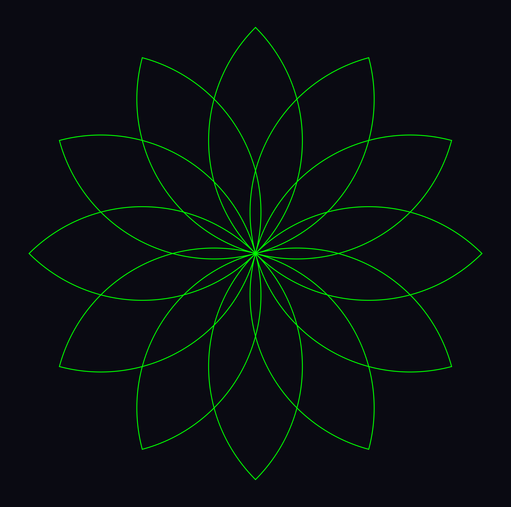
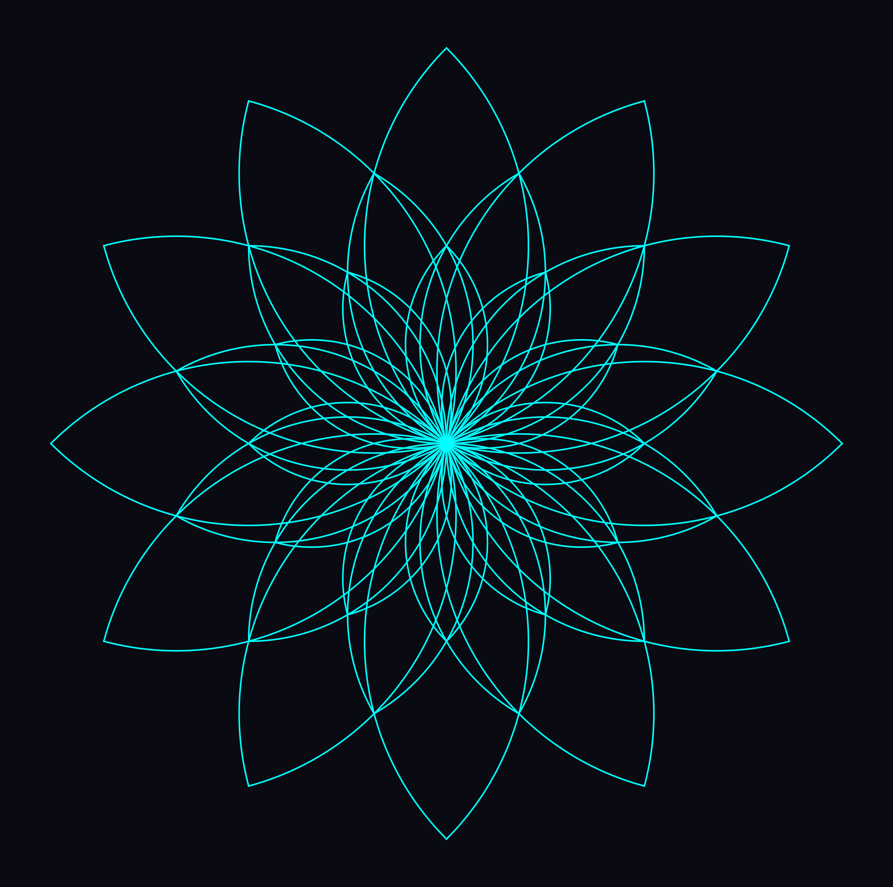
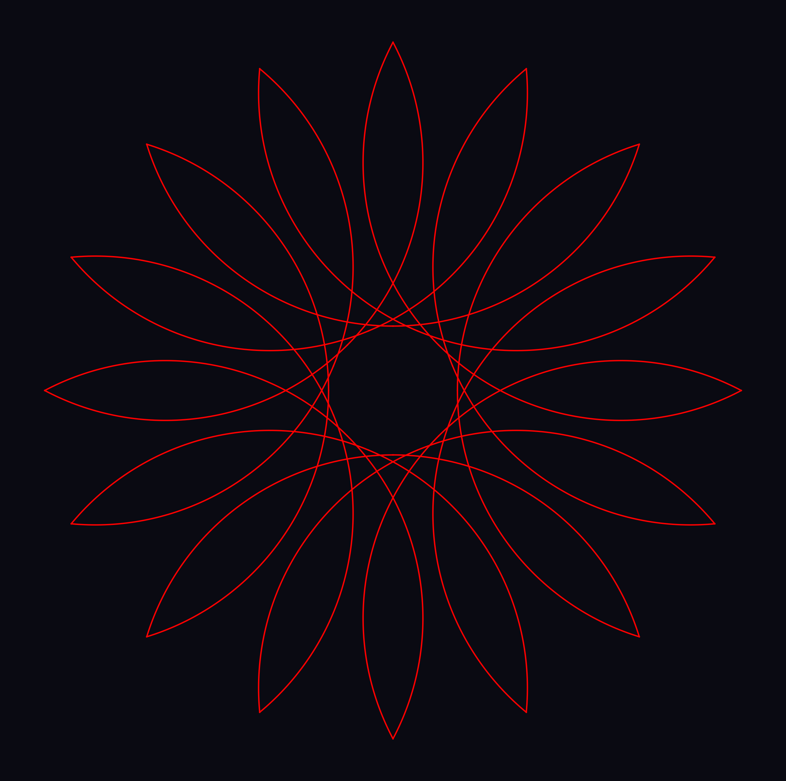
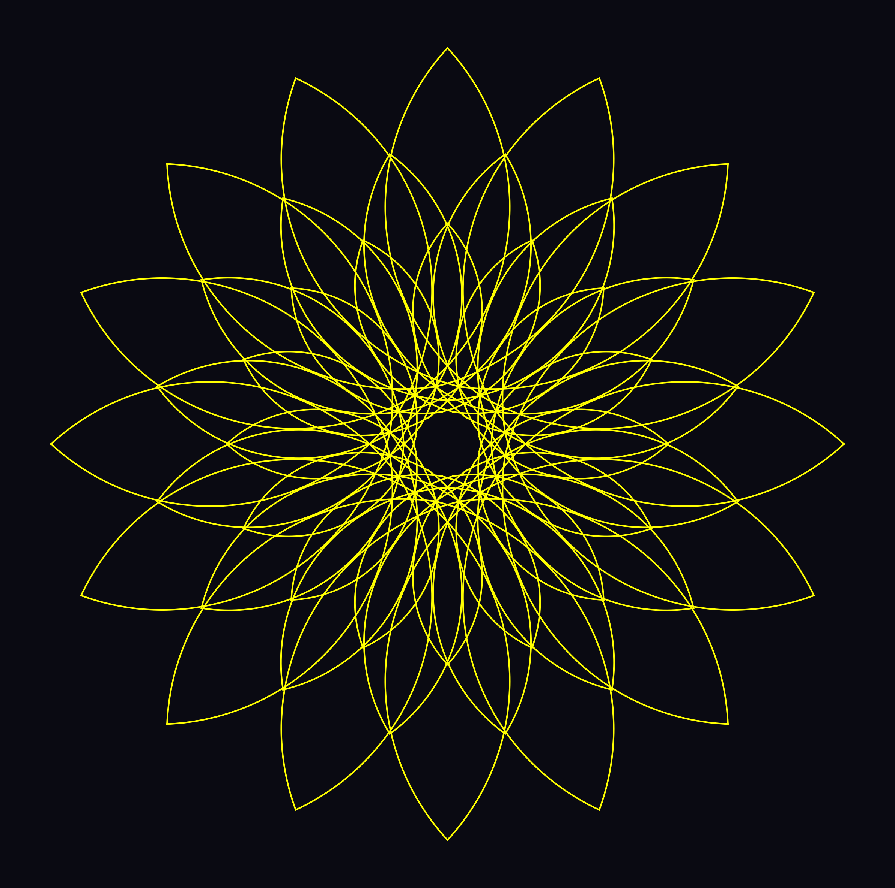
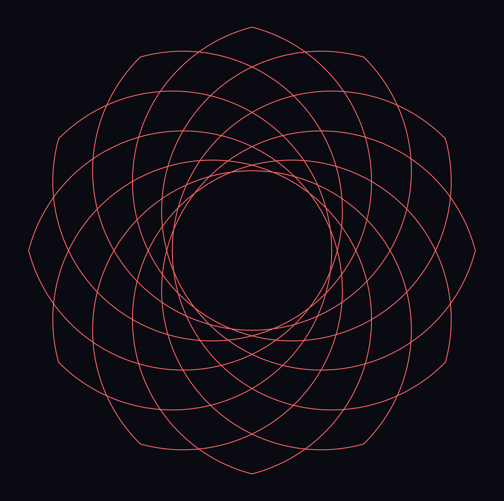
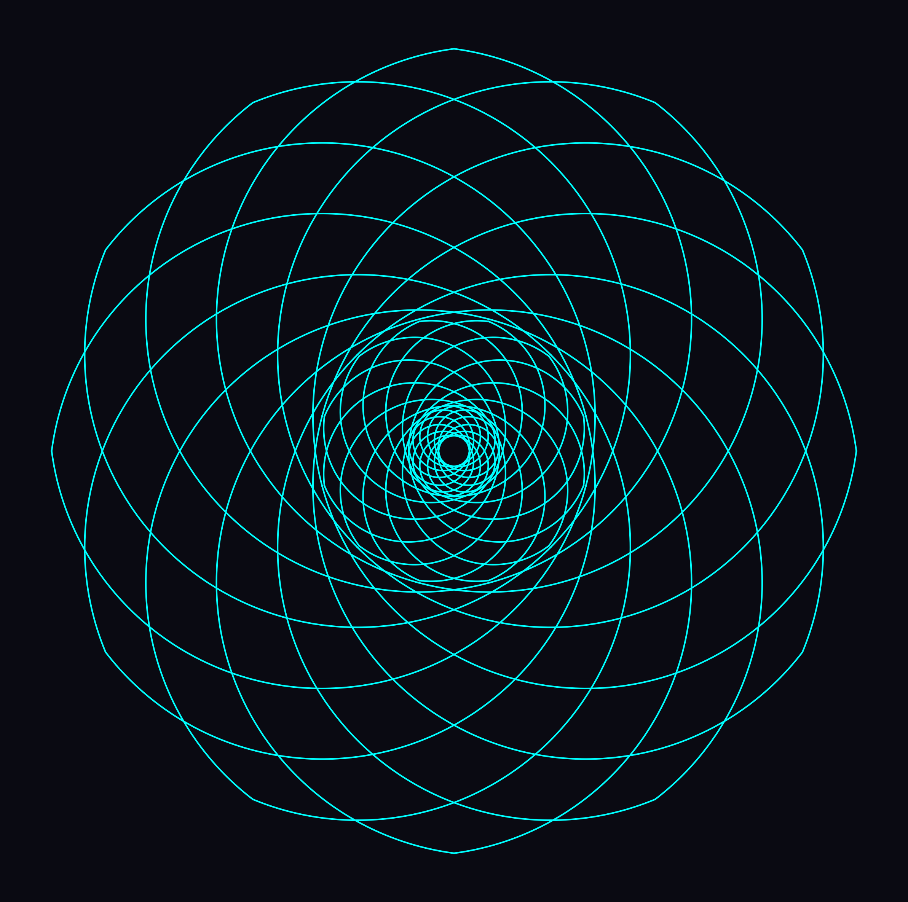
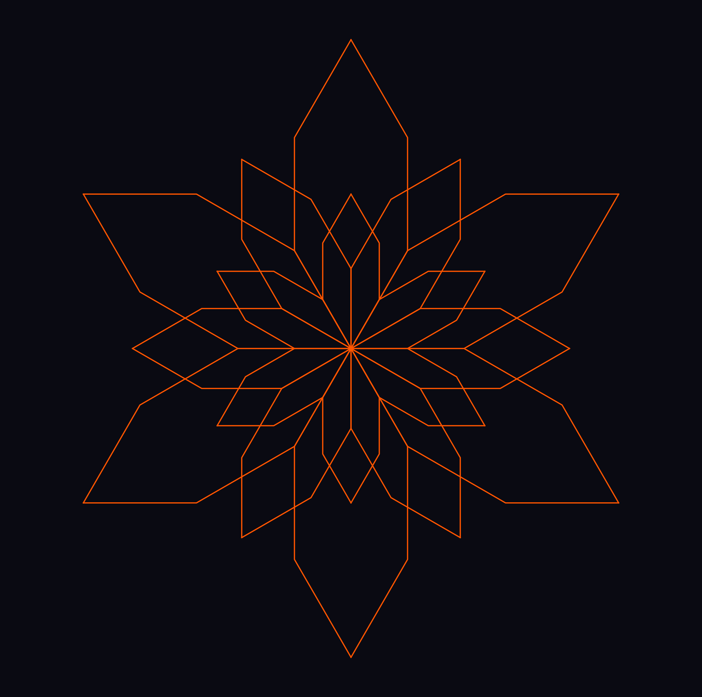
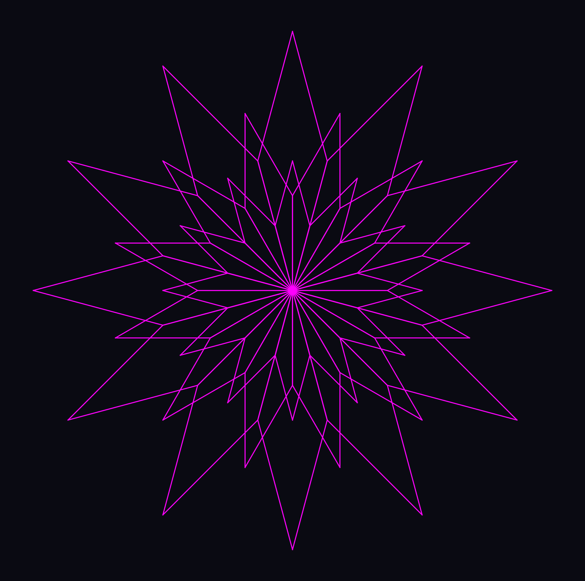
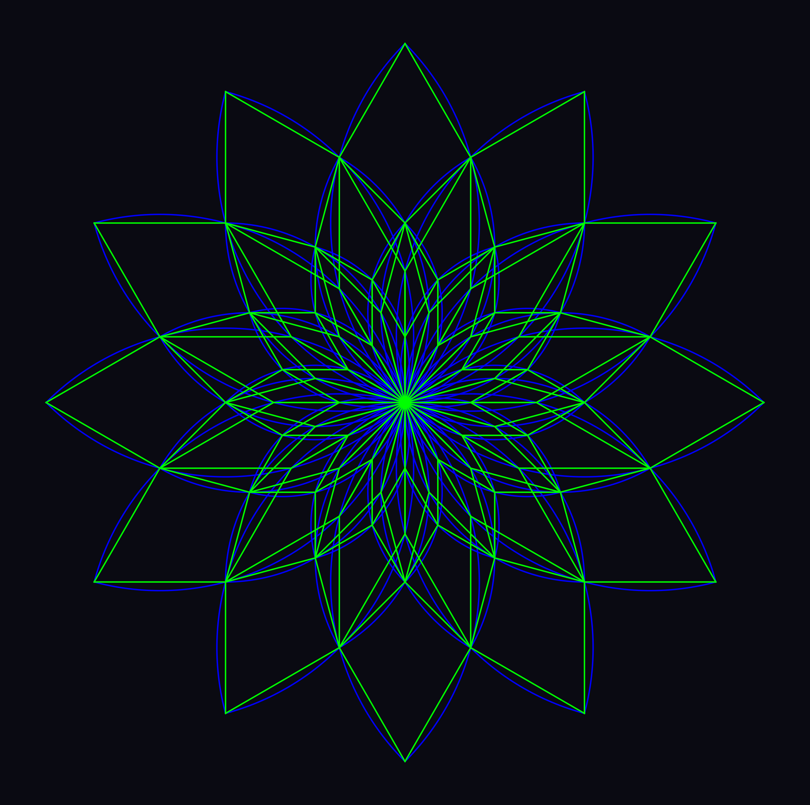

# 圈点圆(CPR)艺术(一)
## 一、CPR艺术的核心定义
**圈点圆（Circle Point Round，CPR）** 艺术是一种以数学逻辑为底层支撑的创意图形艺术形式。其核心创作逻辑是在圆周上设定均匀分布的点，通过点与点之间圆弧的组合、拼接、变换，生成从简约几何图案到复杂自然形态（如花卉、螺旋、星形、波形）的各类视觉作品。

CPR艺术的底层哲学，源于“圈点互化”的二元逻辑：
- 圈收缩至极致即为点，是空间中“无维度”的最小单元；
- 点沿固定轨迹旋转一周形成圈，是“一维曲线闭环”的基础形态。

这种逻辑并非单纯的视觉想象，更与前沿物理理论形成呼应：
- 粒子物理学中，构成物质/非物质的核心是“点粒子”，对应CPR中的“点”；
- 超弦理论/M理论提出，基本粒子本质是开/闭弦的振动，可理解为CPR中“圆弧的拼接与变换”。

>因为圈和点互为阴阳，圈缩一粒为点，点绕一转为圈，圈点足以创造出二元对立世界的一切：因为由基本粒子物理学我们知道构成世界的物质非物质不过是一些点粒子，而超弦理论或M理论又说基本粒子实际上是或开或闭的弦，可以理解为圆弧的拼接或圆弧的变换。因此，掌握圈和点我们便能创造出很多妙不可言的美好。

也正因如此，圈与点的组合能复刻出自然界与设计领域的万千形态——从苹果等知名品牌的logo（由基础圆弧、点、线段构成），到自然界的花卉、星云，皆可通过CPR的逻辑拆解与重构。可以这么说：圈点是艺术的天下！

## 二、CPR艺术的视觉特征
### 1. 基础构成单元
CPR艺术的所有作品，均由以下核心单元组合而成：
- **点(线)**：空间坐标的锚点，是圆弧的起点、终点或圆心或线段；
- **圆弧**：不同半径、不同弧度的曲线，是连接点的核心载体；
- **圆**：特殊的闭合圆弧，是CPR创作的“基准框架”。

### 2. 典型视觉效果
通过调整“圆周点数、圆弧半径、旋转角度、层数”等参数，CPR可生成：
- 对称花卉形态（如睡莲、曼陀罗）；
- 螺旋/星型几何图案；
- 波形叠加的抽象纹理；
- 环面/多面体拼接的立体视觉（后续章节展开）。

## 三、CPR艺术的创作维度
### 1. 数学维度
CPR的创作本质是“参数化设计”，核心数学要素包括：
- 圆周等分：将圆的360°均匀拆分为N个点，N决定图案的对称度；
- 半径比例：外圆与内圆的半径比（如√2），决定图案的“舒展度”；
- 角度旋转：整体或局部圆弧的旋转偏移，赋予图案动态感；
- 层数叠加：多层圆弧的嵌套，让图案从“平面”走向“层次化”。

### 2. 艺术维度
数学是CPR的“骨架”，艺术表达则是其“血肉”：
- 色彩：单一色的渐变、多色的对比，可强化图案的视觉冲击；
- 透明度：圆弧的半透明叠加，可营造通透的“叠影效果”；
- 精度：构成圆弧的点数（采样精度），决定图案的细腻度；
- 创意重构：打破“均匀等分”的常规，刻意调整部分点的间距/圆弧半径，生成不规则但有秩序的独特形态。

## 四、CPR艺术的实践预告
从“理论认知”到“视觉落地”，CPR艺术的魅力在于“可亲手创作”：
- 后续章节将基于Python的cprdspy工具（Circle Point Round Dot Surface Pyramid，圈点圆面金字塔），手把手教大家：
  1. 搭建CPR创作的编程环境（Python + cprdspy）；
  2. 用基础参数生成第一朵CPR睡莲；
  3. 调整参数DIY不同瓣数、不同形态的花卉；
  4. 进阶创作螺旋、星型、环面等复杂CPR图案；
  5. 结合设计思维，将CPR图案应用于logo、装饰画、数字艺术创作。

> 下一章，我们将从“环境搭建”开始，让抽象的CPR理论落地为可触摸的视觉作品——无需深厚的编程基础，只需理解“圈与点”的核心逻辑，人人都能创作出独属于自己的CPR艺术。

## 附：CPR艺术示例图
| 类型         | 示例效果       |
| ------------ | -------------- |
| 基础睡莲     |  |
| 标准睡莲     |  |
| 曼陀罗花     |  |
| 曼陀罗结合体 |  |
| 荷花         |  |
| 多层荷花     |  |
| 星形         |  |
| 星形结合体   |  |
| 睡莲对应星形 |  |

---
